## Time complexity
### Introduction
#### A lot of students get confused while understanding the concept of time complexity, but in this article, we will explain it with a very simple example.

#### Q. Imagine a classroom of 100 students in which you gave your pen to one person. You have to find that pen without knowing to whom you gave it. 

#### Here are some ways to find the pen and what the O order is.

- $O(n^2$): You go and ask the first person in the class if he has the pen. Also, you ask this person about the other 99 people in the classroom if they have that pen and so on, 
This is what we call $O(n^2)$. 
- $O(n)$: Going and asking each student individually is $O(n)$. 
- $O(log n)$: Now I divide the class into two groups, then ask: “Is it on the left side, or the right side of the classroom?” Then I take that group and divide it into two and ask again, and so on. Repeat the process till you are left with one student who has your pen. This is what you mean by $O(log n)$. 
#### I might need to do:

- The $O(n^2)$ searches if only one student knows on which student the pen is hidden. 
- The $O(n)$ if one student had the pen and only they knew it. 
- The $O(log n)$ search if all the students knew, but would only tell me if I guessed the right side.

### Time complexity difference

### Show code!
#### $O(1)$
```C++
#include <iostream>
using namespace std;

int main()
{
    cout << "Hello World";
    return 0;
}
```
<details>
<summary>Why O(1)</summary>

- Time Complexity: In the above code “Hello World” is printed only once on the screen. 

- So, the time complexity is constant: $O(1)$ i.e. every time a constant amount of time is required to execute code, no matter which operating system or which machine configurations you are using. 

</details>

#### $O(n)$
```C++
#include <iostream>
using namespace std;

int main()
{

    int i, n = 8;
    for (i = 1; i <= n; i++) {
        cout << "Hello World !!!\n";
    }
    return 0;
}
```
<details>
<summary>Why O(n)</summary>

- Time Complexity: In the above code “Hello World !!!” is printed only n times on the screen, as the value of n can change. 

- So, the time complexity is linear: $O(n)$ i.e. every time, a linear amount of time is required to execute code.

</details>

#### $O(logn)$
```C++
#include <iostream>
using namespace std;

int main()
{

    int i, n = 8;
    for (i = 1; i <= n; i=i*2) {
        cout << "Hello World !!!\n";
    }
    return 0;
}
```

**To read more, refer to this [link](https://www.geeksforgeeks.org/understanding-time-complexity-simple-examples/).**

## Recurtion
### What is Recursion?
#### The process in which a function calls itself directly or indirectly is called recursion and the corresponding function is called a recursive function. Using a recursive algorithm, certain problems can be solved quite easily. Examples of such problems are Towers of Hanoi (TOH), Inorder/Preorder/Postorder Tree Traversals, DFS of Graph, etc. A recursive function solves a particular problem by calling a copy of itself and solving smaller subproblems of the original problems. Many more recursive calls can be generated as and when required. It is essential to know that we should provide a certain case in order to terminate this recursion process. So we can say that every time the function calls itself with a simpler version of the original problem.

### Need of Recursion

#### Recursion is an amazing technique with the help of which we can reduce the length of our code and make it easier to read and write. It has certain advantages over the iteration technique which will be discussed later. A task that can be defined with its similar subtask, recursion is one of the best solutions for it. For example; The factorial of a number.

### Properties of Recursion:
- Performing the same operations multiple times with different inputs.
- In every step, we try smaller inputs to make the problem smaller.
- Base condition is needed to stop the recursion otherwise infinite loop will occur.
#### Algorithm: Steps
1. Step1 - Define a base case: Identify the simplest case for which the solution is known or trivial. This is the stopping condition for the recursion, as it prevents the function from infinitely calling itself.
2. Step2 - Define a recursive case: Define the problem in terms of smaller subproblems. Break the problem down into smaller versions of itself, and call the function recursively to solve each subproblem.
3. Step3 - Ensure the recursion terminates: Make sure that the recursive function eventually reaches the base case, and does not enter an infinite loop.
4. step4 - Combine the solutions: Combine the solutions of the subproblems to solve the original problem.
### Show code!
#### $sum(n)$
```C++
#include <iostream>
using namespace std;

int sum(int n) 
{
    if (n == 0)
    {
        return 0;
    }
    else
    {
        return n + sum(n-1);
    }
}
int main()
{
    cout<<sum(5);
    return 0;
}
```
<details>
<summary>Iterative</summary>

```C++
#include <iostream>
using namespace std;

int sum(int n) 
{
    int sum = 0;
    for(int i = 0; i <= n; i++)
    {
        sum += i;
    }
    return sum;
}
int main()
{
    cout<<sum(5);
    return 0;
}
```
</details>


#### $fact(n)$
```C++
#include <iostream>
using namespace std;

int fact(int n) 
{
    if (n == 0 || n == 1)
    {
        return 1;
    }
    else
    {
        return n * fact(n-1);
    }
}
int main()
{
    cout<<fact(5);
    return 0;
}
```

<details>
<summary>Iterative</summary>

```C++
#include <iostream>
using namespace std;

int fact(int n) 
{
    int fact = 1;
    for(int i = 2; i <= n; i++)
    {
        fact *= i;
    }
    return fact;
}
int main()
{
    cout<<fact(5);
    return 0;
}
```
</details>


#### $fib(n)$
`
[0, 1, 1, 2, 3, 5, 8, 13, 21 , ...]
`
```C++
#include <iostream>
using namespace std;

int fib(int n) 
{
    if (n == 0)
    {
        return 0;
    }
    else if(n == 1 || n == 2)
    {
        return 1;
    }
    else
    {
        return fib(n-1) + fib(n-2);
    }
}
int main()
{
    cout<<fib(5);
    return 0;
}
```

<details>
<summary>Iterative</summary>

```C++
#include <iostream>
using namespace std;

int fib(int n) 
{
    int a0 = 0;
    int a1 = 1;
    int current;
    if (n == 0)
    {
        return a0;
    }
    else if(n == 1)
    {
        return a1;
    }
    else 
    {
        for (int i = 2; i <= n; i++)
        {
            current = a0 + a1;
            a0 = a1;
            a1 = current;
        }
        return current;
    }
}
int main()
{
    cout<<fib(5);
    return 0;
}
```
</details>

**To read more, refer to this [link](https://www.geeksforgeeks.org/introduction-to-recursion-2/).**

## Searching

### Linear search
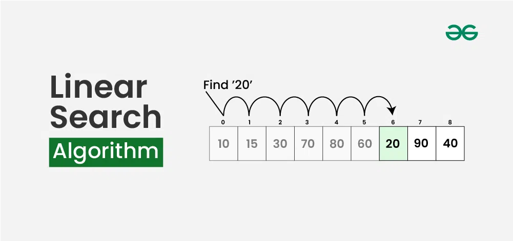

#### What is Linear Search Algorithm?
**Linear search** is a method for searching for an element in a collection of elements. In linear search, each element of the collection is visited one by one in a sequential fashion to find the desired element. Linear search is also known as **sequential search**.

#### Algorithm for Linear Search Algorithm
The algorithm for linear search can be broken down into the following steps:
- **Start**: Begin at the first element of the collection of elements.
- **Compare**: Compare the current element with the desired element.
- **Found**: If the current element is equal to the desired element, return true or index to the current element.
- **Move**: Otherwise, move to the next element in the collection.
- **Repeat**: Repeat steps 2-4 until we have reached the end of collection.
- **Not found**: If the end of the collection is reached without finding the desired element, return that the desired element is not in the array.

#### How Does Linear Search Algorithm Work?
- In Linear Search Algorithm, 
- Every element is considered as a potential match for the key and checked for the same.
- If any element is found equal to the key, the search is successful and the index of that element is returned.
- If no element is found equal to the key, the search yields “No match found”.

#### Example
**For example**: Consider the array arr[] = {10, 50, 30, 70, 80, 20, 90, 40} and key = 30
- **Step 1**: Start from the first element (index 0) and compare key with each element (arr[i]).
    - Comparing key with first element arr[0]. SInce not equal, the iterator moves to the next element as a potential match.
    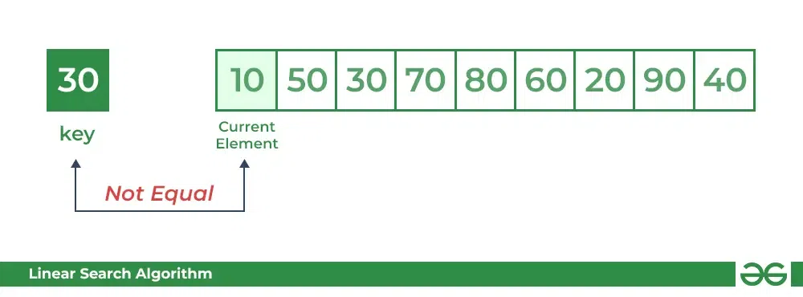
    - Comparing key with next element arr[1]. SInce not equal, the iterator moves to the next element as a potential match.
    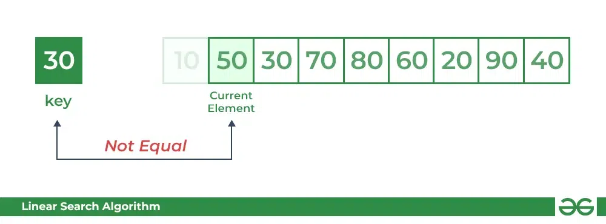
- **Step 2**: Now when comparing arr[2] with key, the value matches. So the Linear Search Algorithm will yield a successful message and return the index of the element when key is found (here 2).
    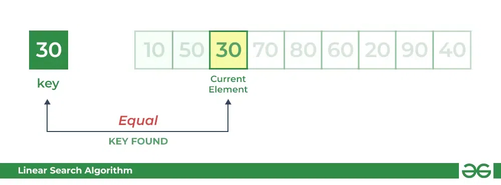

#### Implementation
```C++
#include <iostream>
using namespace std;

int search(int arr[], int size, int key)
{
    for (int i = 0; i < size; i++)
        if (arr[i] == key)
            return i;
    return -1;
}
int main(void)
{
    int size = 5;
    int arr[size] = { 2, 3, 4, 10, 40 };
    int key = 10;

    int result = search(arr, size, key);
    if (result == -1)
    {
        cout << "Element is not present in array";
    }
    else
    {
       cout << "Element is present at index " << result; 
    }
    return 0;
}
```
**To read more, refer to this [link](https://www.geeksforgeeks.org/linear-search/).**

### Binary search
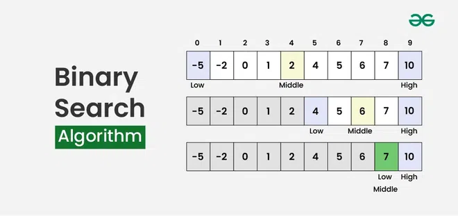

#### What is Binary Search Algorithm?
**Binary search** is a search algorithm used to find the position of a target value within a **sorted** array. It works by repeatedly dividing the search interval in half until the target value is found or the interval is empty. The search interval is halved by comparing the target element with the middle value of the search space.

#### Conditions to apply Binary Search Algorithm in a Data Structure
To apply Binary Search algorithm:
- The data structure must be sorted.
- Access to any element of the data structure should take constant time.

#### Binary Search Algorithm
Below is the step-by-step algorithm for Binary Search:

- Divide the search space into two halves by finding the middle index “mid”. 
- Compare the middle element of the search space with the key. 
- If the key is found at middle element, the process is terminated.
- If the key is not found at middle element, choose which half will be used as the next search space.
    - If the key is smaller than the middle element, then the left side is used for next search.
    - If the key is larger than the middle element, then the right side is used for next search.
- This process is continued until the key is found or the total search space is exhausted.

#### Example
**For example**: Consider an array arr[] = {2, 5, 8, 12, 16, 23, 38, 56, 72, 91}, and the target = 23.
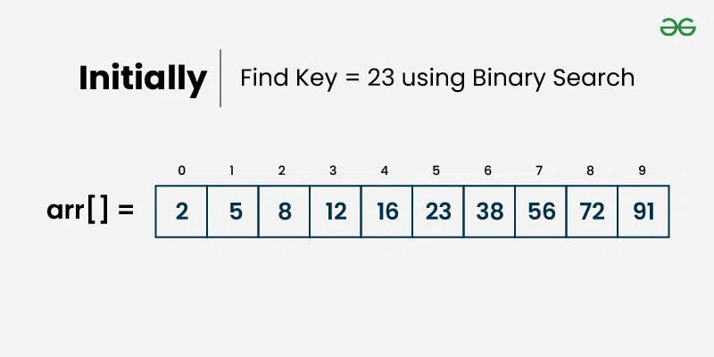
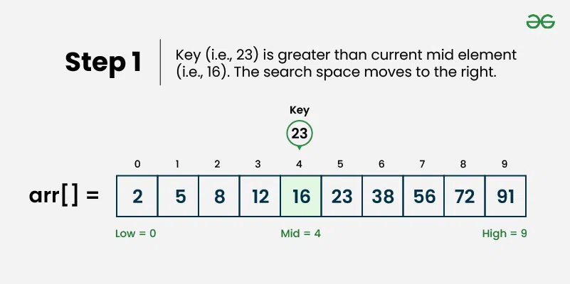
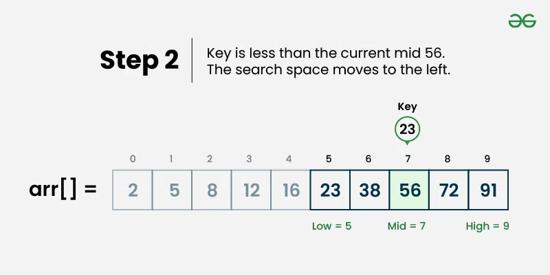
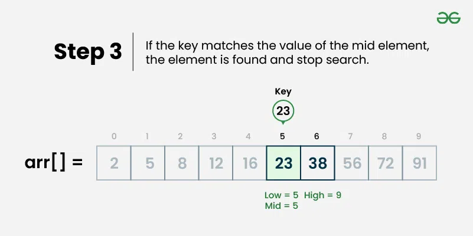

#### Implementation
```C++
#include <iostream>
using namespace std;
int binarySearch(int arr[], int low, int high, int target)
{
    if (high >= low) 
    {
        int mid = low + (high - low) / 2;

        if (arr[mid] == target)
            return mid;

        if (arr[mid] > target)
            return binarySearch(arr, low, mid - 1, target);

        return binarySearch(arr, mid + 1, high, target);
    }
  return -1;
}

int main()
{
    int size = 5;
    int arr[5] = { 2, 3, 4, 10, 40 };
    int target = 10;
    int result = binarySearch(arr, 0, size - 1, target);
    if (result == -1) 
    {
        cout << "Element is not present in array";
    }
    else 
    {
        cout << "Element is present at index " << result;
    }
    return 0;
}
```
**To read more, refer to this [link](https://www.geeksforgeeks.org/binary-search/).**

## Sorting
### Selection sort
The algorithm repeatedly selects the smallest (or largest) element from the unsorted portion of the list and swaps it with the first element of the unsorted part. This process is repeated for the remaining unsorted portion until the entire list is sorted. 
#### Example
Lets consider the following array as an example: arr[] = {64, 25, 12, 22, 11}

**First pass:**
- For the first position in the sorted array, the whole array is traversed from index 0 to 4 sequentially. The first position where 64 is stored presently, after traversing whole array it is clear that 11 is the lowest value.
- Thus, replace 64 with 11. After one iteration 11, which happens to be the least value in the array, tends to appear in the first position of the sorted list.


**Second Pass:**
- For the second position, where 25 is present, again traverse the rest of the array in a sequential manner.
- After traversing, we found that 12 is the second lowest value in the array and it should appear at the second place in the array, thus swap these values.


**Third Pass:**
- Now, for third place, where 25 is present again traverse the rest of the array and find the third least value present in the array.
- While traversing, 22 came out to be the third least value and it should appear at the third place in the array, thus swap 22 with element present at third position.
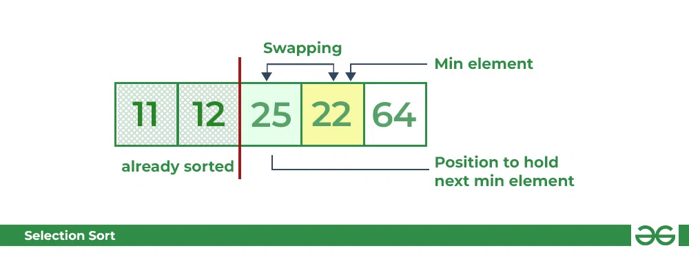

**Fourth pass:**
- Similarly, for fourth position traverse the rest of the array and find the fourth least element in the array 
- As 25 is the 4th lowest value hence, it will place at the fourth position.
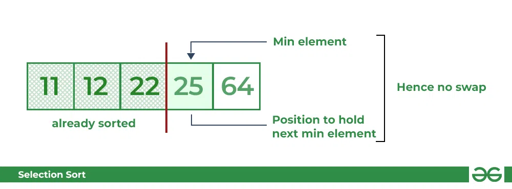

**Fifth Pass:**
- At last the largest value present in the array automatically get placed at the last position in the array
- The resulted array is the sorted array.


#### Implementation
```C++
#include <iostream>
using namespace std;

void selectionSort(int arr[], int size)
{

    for (int i = 0; i < size - 1; i++)
    {
        int min_idx = i;
        for (int j = i + 1; j < size; j++)
        {
            if (arr[j] < arr[min_idx])
            {
                min_idx = j;
            }
        }

        if (min_idx != i)
        {
            swap(arr[min_idx], arr[i]);
        }
    }
}

void printArray(int arr[], int size)
{
    for (int i = 0; i < size; i++)
    {
        cout << arr[i] << " ";
    }
    cout << endl;
}
int main()
{
    int size = 5;
    int arr[size] = {64, 25, 12, 22, 11};
    selectionSort(arr, size);
    cout << "Sorted array: \n";
    printArray(arr, size);
    return 0;
}
```
**To read more, refer to this [link](https://www.geeksforgeeks.org/selection-sort-algorithm-2/).**

### Bubble sort
In Bubble Sort algorithm, 

- traverse from left and compare adjacent elements and the higher one is placed at right side. 
- In this way, the largest element is moved to the rightmost end at first. 
- This process is then continued to find the second largest and place it and so on until the data is sorted.
#### How does Bubble Sort Work?
Let us understand the working of bubble sort with the help of the following illustration:
#### Example

**Input:** arr[] = {6, 0, 3, 5}

**First Pass:** The largest element is placed in its correct position, i.e., the end of the array.


**Second Pass:** Place the second largest element at correct position


**Third Pass:** Place the remaining two elements at their correct positions.
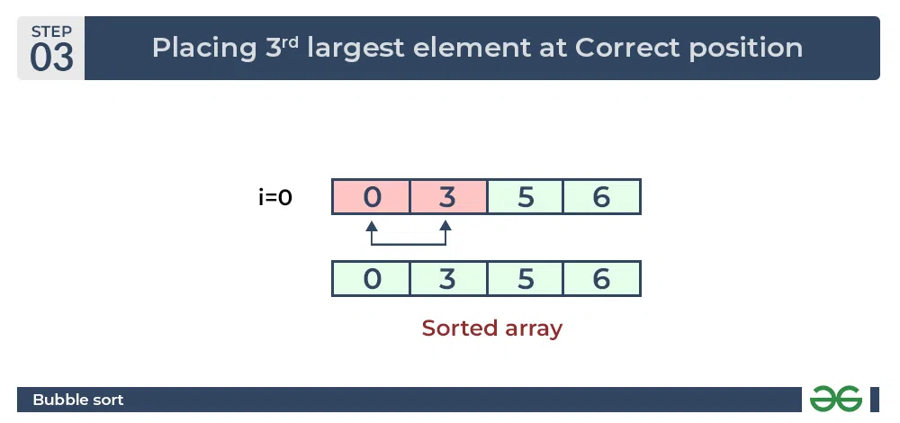

#### Implementation
```C++
#include <iostream>
using namespace std;
void bubbleSort(int arr[], int size)
{
    int i, j;
    bool swapped;
    for (i = 0; i < size - 1; i++)
    {
        swapped = false;
        for (j = 0; j < size - i - 1; j++)
        {
            if (arr[j] > arr[j + 1])
            {
                swap(arr[j], arr[j + 1]);
                swapped = true;
            }
        }
        if (swapped == false)
        {
            break;
        }
    }
}

void printArray(int arr[], int size)
{
    int i;
    for (i = 0; i < size; i++)
        cout << " " << arr[i];
}

int main()
{
    int size = 7;
    int arr[size] = {64, 34, 25, 12, 22, 11, 90};
    bubbleSort(arr, size);
    cout << "Sorted array: \n";
    printArray(arr, size);
    return 0;
}
```
**To read more, refer to this [link](https://www.geeksforgeeks.org/bubble-sort-algorithm/).**

### Merge sort

#### How does Merge Sort work?
Merge sort is a popular sorting algorithm known for its efficiency and stability. It follows the divide-and-conquer approach to sort a given array of elements.

Here’s a step-by-step explanation of how merge sort works:

- **Divide**: Divide the list or array recursively into two halves until it can no more be divided.
- **Conquer**: Each subarray is sorted individually using the merge sort algorithm.
- **Merge**: The sorted subarrays are merged back together in sorted order. The process continues until all elements from both subarrays have been merged.
#### Example
Let’s sort the array or list [38, 27, 43, 10] using Merge Sort

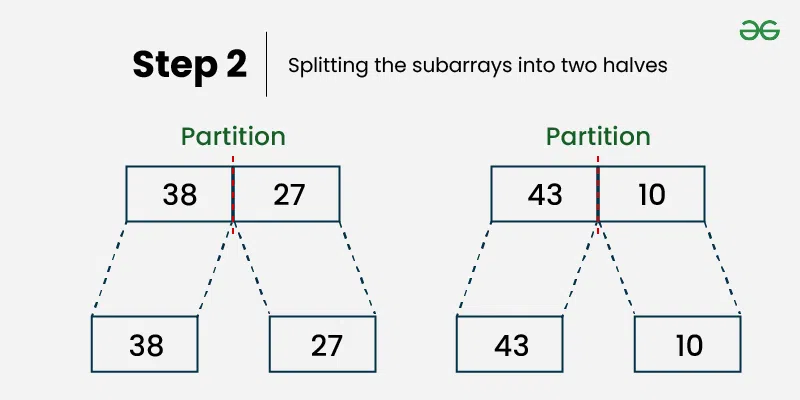
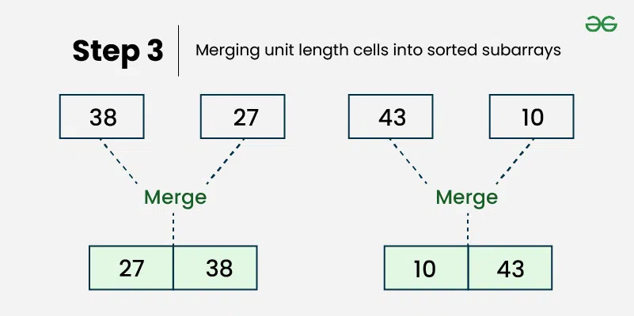
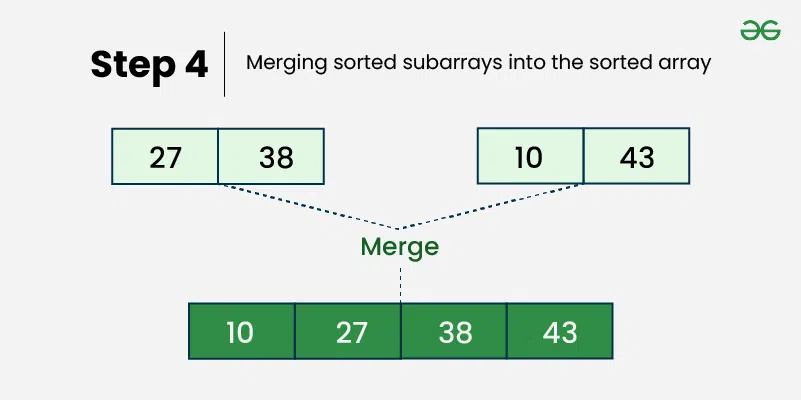
#### Implementation
```C++
#include <iostream>
using namespace std;
void merge(int arr[], int left,
           int mid, int right)
{
    int left_size = mid - left + 1;
    int right_size = right - mid;

    int L[left_size], R[right_size];

    for (int i = 0; i < left_size; i++)
    {
        L[i] = arr[left + i];
    }
    for (int j = 0; j < right_size; j++)
    {
        R[j] = arr[mid + 1 + j];
    }

    int i = 0, j = 0;
    int k = left;

    while (i < left_size && j < right_size)
    {
        if (L[i] <= R[j])
        {
            arr[k] = L[i];
            i++;
        }
        else
        {
            arr[k] = R[j];
            j++;
        }
        k++;
    }

    while (i < left_size)
    {
        arr[k] = L[i];
        i++;
        k++;
    }

    while (j < right_size)
    {
        arr[k] = R[j];
        j++;
        k++;
    }
}

void mergeSort(int arr[], int left, int right)
{
    if (left >= right)
    {
        return;
    }
    int mid = left + (right - left) / 2;
    mergeSort(arr, left, mid);
    mergeSort(arr, mid + 1, right);
    merge(arr, left, mid, right);
}

void printVector(int arr[], int size)
{
    for (int i = 0; i < size; i++)
    {
        cout << arr[i] << " ";
    }
    cout << endl;
}

int main()
{
    int size = 6;
    int arr[size] = {12, 11, 13, 5, 6, 7};

    cout << "Given array is \n";
    printVector(arr, size);

    mergeSort(arr, 0, size - 1);

    cout << "\nSorted array is \n";
    printVector(arr, size);
    return 0;
}
```
**To read more, refer to this [link](https://www.geeksforgeeks.org/merge-sort/).**

## Suggestions for further reading
1. Different time complexity notations
2. Time complexity interview method of recursive functions
3. Tower of Hanoi
4. Find the maximum and minimum
5. Insertion Sort
5. Quick sort
6. .....
