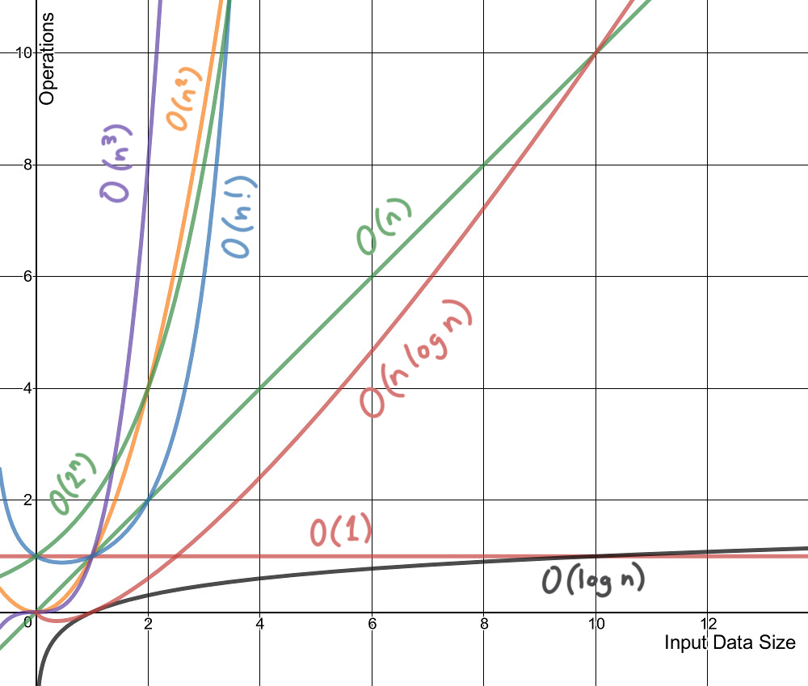

## Time complexity
### Introduction
#### A lot of students get confused while understanding the concept of time complexity, but in this article, we will explain it with a very simple example.

#### Q. Imagine a classroom of 100 students in which you gave your pen to one person. You have to find that pen without knowing to whom you gave it. 

#### Here are some ways to find the pen and what the O order is.

- $O(n^2$): You go and ask the first person in the class if he has the pen. Also, you ask this person about the other 99 people in the classroom if they have that pen and so on, 
This is what we call $O(n^2)$. 
- $O(n)$: Going and asking each student individually is $O(n)$. 
- $O(log n)$: Now I divide the class into two groups, then ask: “Is it on the left side, or the right side of the classroom?” Then I take that group and divide it into two and ask again, and so on. Repeat the process till you are left with one student who has your pen. This is what you mean by $O(log n)$. 
#### I might need to do:

- The $O(n^2)$ searches if only one student knows on which student the pen is hidden. 
- The $O(n)$ if one student had the pen and only they knew it. 
- The $O(log n)$ search if all the students knew, but would only tell me if I guessed the right side.

### Time complexity difference

### Show code!
#### $O(1)$
```C++
#include <iostream>
using namespace std;

int main()
{
    cout << "Hello World";
    return 0;
}
```
<details>
<summary>Why O(1)</summary>

- Time Complexity: In the above code “Hello World” is printed only once on the screen. 

- So, the time complexity is constant: $O(1)$ i.e. every time a constant amount of time is required to execute code, no matter which operating system or which machine configurations you are using. 

</details>

#### $O(n)$
```C++
#include <iostream>
using namespace std;

int main()
{

    int i, n = 8;
    for (i = 1; i <= n; i++) {
        cout << "Hello World !!!\n";
    }
    return 0;
}
```
<details>
<summary>Why O(n)</summary>

- Time Complexity: In the above code “Hello World !!!” is printed only n times on the screen, as the value of n can change. 

- So, the time complexity is linear: $O(n)$ i.e. every time, a linear amount of time is required to execute code.

</details>

#### $O(logn)$
```C++
#include <iostream>
using namespace std;

int main()
{

    int i, n = 8;
    for (i = 1; i <= n; i=i*2) {
        cout << "Hello World !!!\n";
    }
    return 0;
}
```

**To read more, refer to this [link](https://www.geeksforgeeks.org/understanding-time-complexity-simple-examples/).**

## Recurtion
### What is Recursion?
#### The process in which a function calls itself directly or indirectly is called recursion and the corresponding function is called a recursive function. Using a recursive algorithm, certain problems can be solved quite easily. Examples of such problems are Towers of Hanoi (TOH), Inorder/Preorder/Postorder Tree Traversals, DFS of Graph, etc. A recursive function solves a particular problem by calling a copy of itself and solving smaller subproblems of the original problems. Many more recursive calls can be generated as and when required. It is essential to know that we should provide a certain case in order to terminate this recursion process. So we can say that every time the function calls itself with a simpler version of the original problem.

### Need of Recursion

#### Recursion is an amazing technique with the help of which we can reduce the length of our code and make it easier to read and write. It has certain advantages over the iteration technique which will be discussed later. A task that can be defined with its similar subtask, recursion is one of the best solutions for it. For example; The factorial of a number.

### Properties of Recursion:
- Performing the same operations multiple times with different inputs.
- In every step, we try smaller inputs to make the problem smaller.
- Base condition is needed to stop the recursion otherwise infinite loop will occur.
#### Algorithm: Steps
1. Step1 - Define a base case: Identify the simplest case for which the solution is known or trivial. This is the stopping condition for the recursion, as it prevents the function from infinitely calling itself.
2. Step2 - Define a recursive case: Define the problem in terms of smaller subproblems. Break the problem down into smaller versions of itself, and call the function recursively to solve each subproblem.
3. Step3 - Ensure the recursion terminates: Make sure that the recursive function eventually reaches the base case, and does not enter an infinite loop.
4. step4 - Combine the solutions: Combine the solutions of the subproblems to solve the original problem.
### Show code!
#### $sum(n)$
```C++
#include <iostream>
using namespace std;

int sum(int n) 
{
    if (n == 0)
    {
        return 0;
    }
    else
    {
        return n + sum(n-1);
    }
}
int main()
{
    cout<<sum(5);
    return 0;
}
```
<details>
<summary>Iterative</summary>

```C++
#include <iostream>
using namespace std;

int sum(int n) 
{
    int sum = 0;
    for(int i = 0; i <= n; i++)
    {
        sum += i;
    }
    return sum;
}
int main()
{
    cout<<sum(5);
    return 0;
}
```
</details>


#### $fact(n)$
```C++
#include <iostream>
using namespace std;

int fact(int n) 
{
    if (n == 0 || n == 1)
    {
        return 1;
    }
    else
    {
        return n * fact(n-1);
    }
}
int main()
{
    cout<<fact(5);
    return 0;
}
```

<details>
<summary>Iterative</summary>

```C++
#include <iostream>
using namespace std;

int fact(int n) 
{
    int fact = 1;
    for(int i = 2; i <= n; i++)
    {
        fact *= i;
    }
    return fact;
}
int main()
{
    cout<<fact(5);
    return 0;
}
```
</details>


#### $fib(n)$
`
[0, 1, 1, 2, 3, 5, 8, 13, 21 , ...]
`
```C++
#include <iostream>
using namespace std;

int fib(int n) 
{
    if (n == 0)
    {
        return 0;
    }
    else if(n == 1 || n == 2)
    {
        return 1;
    }
    else
    {
        return fib(n-1) + fib(n-2);
    }
}
int main()
{
    cout<<fib(5);
    return 0;
}
```

<details>
<summary>Iterative</summary>

```C++
#include <iostream>
using namespace std;

int fib(int n) 
{
    int a0 = 0;
    int a1 = 1;
    int current;
    if (n == 0)
    {
        return a0;
    }
    else if(n == 1)
    {
        return a1;
    }
    else 
    {
        for (int i = 2; i <= n; i++)
        {
            current = a0 + a1;
            a0 = a1;
            a1 = current;
        }
        return current;
    }
}
int main()
{
    cout<<fib(5);
    return 0;
}
```
</details>

**To read more, refer to this [link](https://www.geeksforgeeks.org/introduction-to-recursion-2/).**

## Searching
### Linear search
### Binary search

## Sorting
### Selection sort
### Buble sort
### Merge sort

## Suggestions for further reading
1. Different time complexity notations
2. Time complexity interview method of recursive functions
3. Tower of Hanoi
4. Find the maximum and minimum
5. Insertion Sort
5. Quick sort
6. .....
